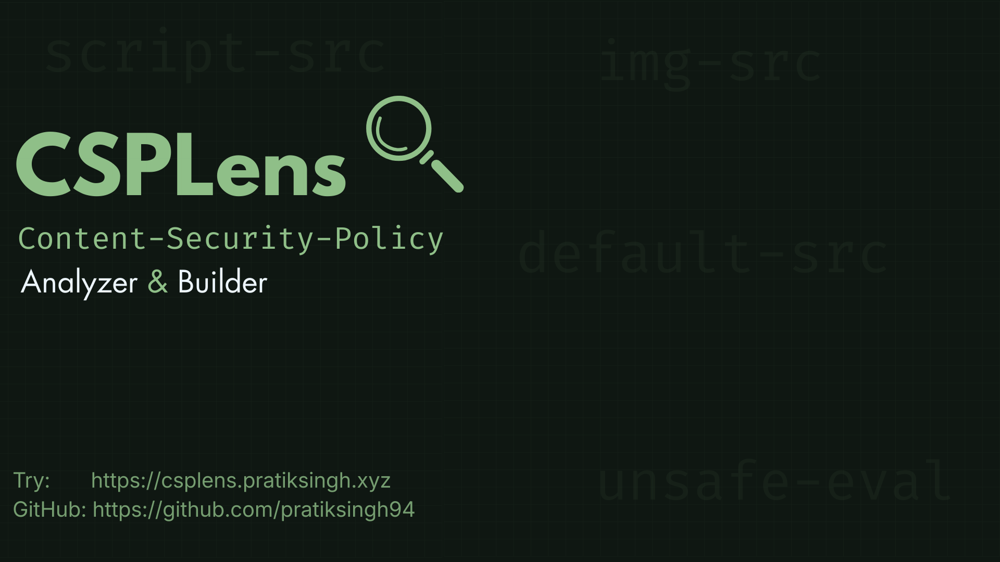

<p align="center">
  
</p>

# CSPLens — CSP Analyser & Builder


CSPLens is a developer-focused tool for analyzing, understanding, and improving **Content Security Policies (CSP)**.    


> ⚠️ **Status:** Under active development  
> I will make changes whenever I feel like :3

---

## What is CSPLens?

CSPLens analyzes a given `Content-Security-Policy` and breaks it down into:
- Risk levels per source expression
- Missing or critical directives
- Dangerous or invalid CSP patterns
- Clear explanations and recommendations

The goal is not just to say *“this shit is bad”*, but to explain **why** it’s bad and **what to do instead** with proper references.

I built this project as part of [Flavortown 2025 by HackClub](https://flavortown.hackclub.com/), though the idea existed long before that lmao my last HackClub event project didnt go well so I reserved this idea for next event.

---

## What is Content Security Policy (CSP)?

[**Content Security Policy (CSP)**](https://content-security-policy.com/) is a browser security mechanism that helps prevent attacks like:
- Cross-Site Scripting (XSS)
- Data injection
- Malicious third-party script execution

It works by defining **which sources are allowed** to load content such as scripts, styles, images, fonts, and more.    
THIS IS THE BEST THING OUT THERE FOR EASY SECURITY!!

Example:
```http
Content-Security-Policy: script-src 'self';
````

But despite being powerful, CSP is:

* Easy to misconfigure
* Poorly understood
* Often weakened by dangerous keywords like `unsafe-inline` or `unsafe-eval`

You can use CSPLens to analyse your CSP header!

---

## Current Features

* **Policy Overview**

  * Overall policy grade
  * Missing important directives
  * High-risk CSP red flags

* **Source Expression Analysis**

  * Per-source risk levels (GOOD, OK, WARNING, DANGER, INVALID)
  * Context-aware explanations
  * Spec-aware validation (e.g `unsafe-eval` in the wrong directive)

* **Policy Breakdown**

  * Per-directive analysis
  * Interactive source inspection
  * Clear recommendations and references

---

## Planned Features

Ideas I have in my mind, and I will add them whenever I feel like tho

* **Attack Surface Analysis**

  * Unique source counting
  * Possible attacks
  * Overall attack surface scoring

* **CSP Policy Builder**

  * Build CSPs interactively
  * Visual feedback while constructing policies

* **Improved Rule Analysis (current one is a lil mid)**

  * More directive-specific intelligence
  * Probably proper grammar? but that's far in future

* **Reporting & Export**

  * Shareable analysis reports

---

## Tech Stack

* **Next.js**
* **TypeScript**
* **Tailwind CSS**
* **shadcn**

---

## Links

* Flavortown Project Page: [https://flavortown.hackclub.com/projects/2679](https://flavortown.hackclub.com/projects/2679)
* Blog (coming soon): CSP & CSPLens deep dive

---

## License

MIT License ([LICENSE](/LICENSE))
